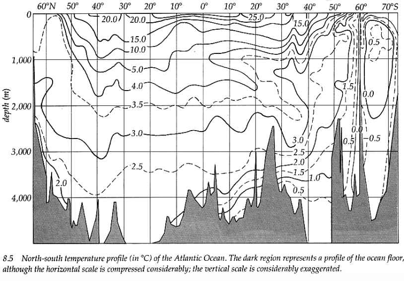
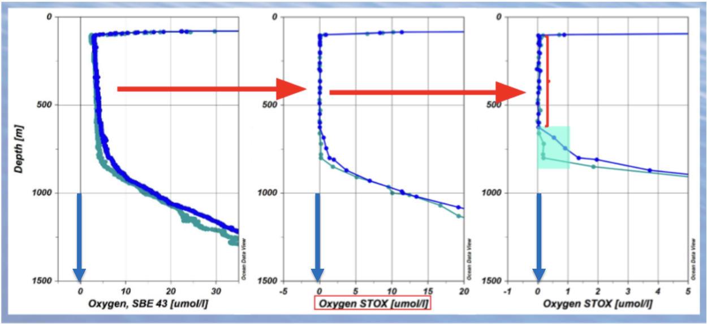

<!-- Usamos el atributo 'align' que es el único que la vista previa y el PDF respetan a la vez -->

## Ecosistemas Marinos - 4 Curso CC del Mar

## Índice de la asignatura:

- TEMA 1. Sistemas en océano profundo I: Aguas profundas y fondos abisales.
- TEMA 2. Sistemas en océano profundo II: Fuentes Hidrotermales.
- TEMA 3. El océano en latitudes altas: Bioma polar.
- TEMA 4. Mares regionales.
- TEMA 5. Estuarios y marismas.
- TEMA 6. Zonas húmedas someras: lagunas hipersalinas y salinas.
- TEMA 7. Modelado de ecosistemas.

###  Ecosistemas Marinos. TEMA 1. Sistemas en océano profundo I: Aguas profundas y fondos abisales.

Gráfica: el 0 representa el nivel base, las tierras que están entre el NM y 1000 metros son las más abundantes en el contexto de las tierras emergidas. Si nos centramos en el océano profundo, nos encontramos con la gran mayoría de tierras. Más de la mitad del planeta Tierra es llano abisal (53,5%).

{width="25%" !important}

#### Variables del medio físico con importancia desde el punto de vista biológico.

- **Temperatura:** fijandonos en la vertical -> zona superficial en la que la T es significativamente más alta que el ambiente profundo (concepto de termoclina). 

Los organismos que viven en aguas profundas experimentan T frías. Oscila generalmente entre -1 y 4 grados C (la mayor parte alrededor de 2ºC). Hay excepciones como el Mediterráneo (13ºC), Antártico (-1,9ºC) y Mar Rojo (21,5ºC).

- **Salinidad:** puede ser un factor de estrés en muchos ambientes, aunque en el caso de los ambientes de océano profundo no representa un factor problemático (adaptación de los organismos y muy poca variación de salinidad entre fondos).

- **Presión:** es muy alta pero predecible. Hay un incremento de 1 atm por cada 10 metros de profundidad que se baja. A pesar de ser muy alta, es estable a una profundidad dada, aunque los migradores verticales sí pueden experimentar cambios de presión notable (muy frecuente en todas las profundidades, pero las que más destacan son las migraciones mesopelágicas).

- **Oxígeno disuelto:** normalmente no supone problemas a mucha profundidad, sino más bien en algunas zonas concretas contaminadas o en algunos mares regionales (Mar Negro). Hay un mínimo de O entre 500 y 1000m.

- **Luz en la columna:** presenta una atenuación exponencial, diferentes según la longitud de onda. Nos interesa el promedio de las longitudes de onda (PAR).

En el eje horizontal se ve la intensidad de la luz medida. Está en escala logaritmica => transforma la curva exponencial en una recta que va decayendo.
El límite máximo ideal para la fotosíntesis marca también el límite de la zona epipelágica. La zona disfótica coincide con la zona mesopelágica y hace referencia a la zona en la que sigue estando presente la luz aunque no en condiciones suficiente para la realización de la fotosíntesis.
En las zonas más profundas empieza a ver bioluminescencia, una condición que afecta a la depredación, la reproducción...

Por tanto, en resumen hay constancia de las condiciones físicas en un punto determinado, el principal limitante es la escasez de alimento puesto que no hay PP.
El mayor suministro de alimentos para las aguas profundas se produce por caída de partículas provenientes desde la superficie.
La mayor parte del alimento que llega a la zona profunda llega por gravedad.

#### Mecanismos de aporte de MO a las aguas profundas.

- Corrientes de turbiditas: restos terrígenos y neríticos canalizados preferentemente por cañones en plataforma y talud.
- Grandes restos de animales -> a pesar de poder pensar que al ser restos grandes sedimenten rapidamente y aporten la mayoría de la MO en ambientes profundos, constituyen aprox el 11% de la MO (poco). Mediante experimentos con submarino, podía haber en promedio una partícula de 2 kg y 4 de 50g. Otro estudio estimó que había un resto de grande mamífero aprox cada 8 km en los fondos abisales.
Puesto que los grandes restos están dispersos, la mayoría de las especies de fondos abisales (carroñeros) tienen una elevada capacidad de detección y patrulla continua.
- Restos finos (plancton): es la mayor parte de la MO que llega, y principal fuente en los ambientes profundos. A pesar de que los restos finos van cayendo lentos y hay gran posibilidad de que se los coma la gran cantidad de especies pelágicas, existe una gran aportación hacia el fondo abisal.

Por que la velocidad es más elevada de una partícula pequeña respecto a la que se esperaría -> **efecto scavenging** = la partícula cayendo va "recogiendo" partículas más pequeñas que se van pegando a ella y aceleran su caída.

Además, al final de un afloramiento, hay una gran acumulación de partículas y hay más formación de microagregados (≠ nieve marina puesto que esta última tiene un menor tamaño ~ 500 micras).

Otra fuente de alimento en el océano profundo es el proceso de convección -> fenómeno muy importante en algunas zonas del océano para explicar el aporte de MO al fondo oceánico. Las partículas más grandes y pesadas terminan en el fondo por gravedad, cayendo rápidas, pero las pequeñas experimentan más la convección.

**Resumen del trabajo:**

Otro trabajo: relación que hay entre PP neta en el eje horizontal y la abundancia de biomasa de zooplancton.

Trophic ladder -> MO guíada.

**Forbes y la Hipótesis Azoica** -> afirma que no hay vida por debajo 550m de profundidad.

Otro trabajo -> biomasa de organismos en relación a la profundidad.

Al representar la biomasa (en logaritmo), quitando este último, saldría una curva muy acusada -> relación entre la producción y la presencia de zooplancton. En sitios más oligotróficos (mar de los Sargazos - giro oligotrófico -) se espera que haya muy poca biomasa tanto en superficie como en profundidad. -> La cantidad de organismos que hay en superficie influye sobre la cantidad de organismos que se encuentran en profundidad.

