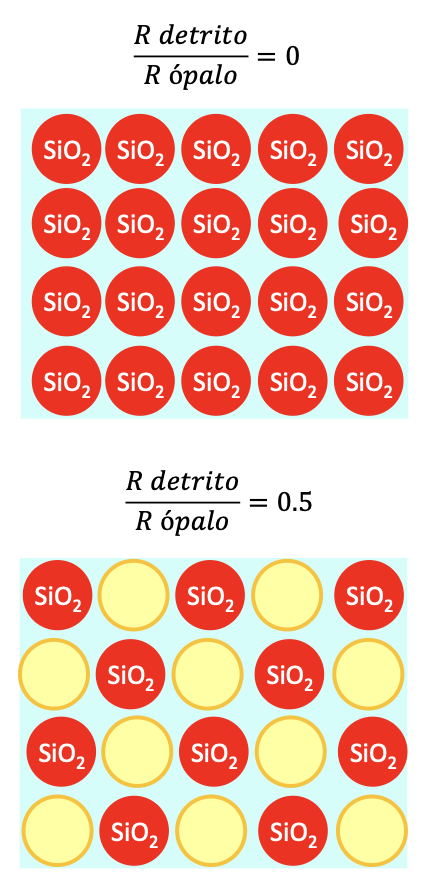

<!-- Usamos el atributo 'align' que es el único que la vista previa y el PDF respetan a la vez -->

## Oceanografía Química Aplicada - 4 Curso CC del Mar

### Índice de la asignatura:

- TEMA 1. Generación de perfiles verticales: reactividad en aguas superficiales y segregación en océano profundo.
- TEMA 2. Modelos biogeoquímicos básicos.
- TEMA 3. Ciclo del carbono inorgánico en el medio marino.
- TEMA 4. Ciclos de nutrientes.
- TEMA 5. Trazadores químicos en oceanografía.
- TEMA 6. Acoplamiento biogeoquímico en el Atlántico Norte.

### Oceanografía Química Aplicada - TEMA 1. Generación de perfiles verticales: reactividad en aguas superficiales y segregación en océano profundo.

### 1. Composición del agua de mar

Composición homogénea de elementos mayoritarios -> Importancia en el cálculo de ρ = f (T, P, S).
Elementos mayoritarios -> 99,9% de las especies disueltas. Concentración > 1ppm. Proporciones relativamente constantes (ventajas mediciones).
La relación entre la concentración de los compuestos mayoritarios es constante (a excepción del C y Ca). 11 compuestos mayoritarios (5 cationes, 6 aniones)
Minoritarios no reactivos también presentan relaciones constantes (Li, Rb, Cs, gases nobles, W, Mo, …).

En el diagrama aparece el bicarbnato puesto que constituye un 90% de las especies del carbónico.
El ácido bórico participa en equilibrio de disociación en el agua de mar.

Composición no homogénea de la mayor parte de los elementos minoritarios. Importancia en la caracterización de procesos de mezcla, biológicos o sedimentarios (trazadores).

### 2. Generación de perfiles verticales

- Perfiles conservativos -> elementos no reactivos (los elementos mayoritarios y minoritarios no reactivos como los gases nobles).
- Elementos retirados -> concentración elevada en superficie que tiende a disminuir con la profundidad.
- Elementos regenerados -> concentración baja en superficie que tiende a aumentar con la profundidad.

Los elementos retirados son muy escasos (ej. Al, Pb..). La mayor parte de los elementos tiene perfiles de elementos regenerados. Nos centramos en ellos.
La explicación de estos perfiles se deben a la incorporación al material particulado en aguas superficiales y liberación en aguas profundas (un mecanismo de incorporación pasiva de los elementos al material particulado es la adsorción). También se dan procesos de incorporación activa (ej. zooplancton). 

- La materia orgánica se oxida;
- Las estructuras duras tienden a la disolución.

**Origen de la materia orgánica:**

Tablas en porcentaje -> las partículas litogénicas son mayor a mayor profundidad: se debe al balance entre las dos profundidades y a la naturaleza porcentaje de los datos. Aumenta el porcentaje puesto que el de la MOP baja mucho -> importancia de los datos en porcentajes.

La actividad biológica en las aguas superficiales es el principal productor de material particulado -> Reactividad de los elementos en los océanos

Primera diferencia en las aguas oceánicas en los perfiles de elementos regenerados de tipo reactivo: “Las aguas profundas están enriquecidas con respecto a las aguas superficiales” (a excepción del oxígeno).

### 3. Clasificación de elementos según su reactvidad

1. Compuestos biolimitantes. Se retiran de las aguas superficiales practicamente en su totalidad (desaparecen) y se regeneran en aguas profundas (reserva).
- $NO_3^-$, $HPO_4^2-$, $SiO_2$, $Fe$, $Zn$, $Cd$, $Co$, $Ge(OH)_4$

2. Compuestos no biolimitantes. No tienden a reaccionar, igual proporción en aguas superficiales y profundas.
- $Na$, $K$, $Rb$, $Cs$, $Mg$, $B$, $S$, $F$, $Cl$, $Br$ (gases nobles, $Mo$, $W$, $V$ y $U$ ?).

3. Compuestos biointermedios. Solo se retira una parte de los elementos y no su totalidad.
- $C$, $Ca$, $Ba$, $Ra$, $Sr$, $Ni$, $Cu$, $Se$;
- ($Ca$ – 1 %, $C$ – 13%, $Ba$ – 70%).

**Comportamiento cíclico**: son retirados en aguas superficiales y vuelven a aparecer en aguas profundas. Tmabién tienen ciclos internos.

4. Compuestos no cíclicos. Por ejemplo el Pb, Mn, Al. No se producen sino que entran a formar parte de las aguas superficiales y son muy reactivos. Tras entrar se asocian al material particulado y empiezan a caer, llegando al fondo del océano. Sistema con entrada y salida, no comportamiento cíclico.

**Los perfiles siempre son más acusados en el Pácifico que en el Atlántico:** 

- **Compuestos biolimitantes:** $NO_3^-$, $HPO_4^{2-}$, $Si(OH)_4$. La MOP suele oxidarse relativamente rápido (el mínimo de la concentración de O se corresponde con la posición de la termoclina permanente -1000m). Por tanto todos los elementos ligados a la MOP tendrán un máximo alrededor de esa profundidad.
El silicato ($Si(OH)_4$) = $SiO_2$ -> Los procesos de disolución de la silice son más lentos que los de disolución de MOP, por tanto el máximo se encontrará más profundo comparado con los elementos asociados a la MOP.

**Cuestiones:**
- La concentración en superficie es practicamente cero (condición para que el elemento sea biolimitante). A medida que aumenta la profundidad va aumentando la concentración. Cuando el organismo ha muerto, la MOP empieza a caer y se liberan los compuestos.

**eGEOTRACES** --> seleccionar el grupo de variables (Biogeoquímica por ej.) + seleccionar el trazador (fosfato por ej.) => aparecen los perfiles. En el Pácifico las variaciones son muchos más acusadas que en el Atlántico. Nos centramos en un transecto del Pácifico.
**eWOCE** --> Elegir océano y visualización de transectos. Información más restringida.

**Oxígeno:** Concentraciónes altas en la zona superficial debido fundamentalmente a dos procesos: masas de aguas en equilibrio con la atmosfera y fotosintesis. A medida que aumenta la profundidad va disminuyendo la concentración de O2 hasta un valor mínimo (máximo de liberación de los nutrientes asociados a la MOP).
**Nitrato:** Tiene la misma distribución que la concentración de $O_2$. En superficie es practicamente cero y a medida que el organismo muere y la MOP va cayendo y se oxida, el máx de concentración de nitrato coincide con el mínimo de concentración de $O_2$. Proceso de segregación horizontal en el océano profundo.
**Fosfato:** Concentración cero en superficie (biolimitante) y mismo comportamiento que los otros dos anteriores. Mismos perfiles puesto que está incluido como parte de la MOP.
**Sílice:** En aguas superficiales hay condición de elemento biolimitante. Conforme vayan muriendose los organismos, los procesos de disolución son más lentos en este caso, por tanto los máximos ocurren a mayor profundidad comparado con los demás elementos.

**Resto de elementos biolimitantes:**

- Fe: nutriente necesario para muchos procesos. Esencial para el desarrollo del fitoplancton. Necesario para la fotosíntesis, fijación de $N_2$ por diazótrofos, síntesis de clorofila y enzimas clave del metabolismo celular. Suele estar asociado a la MOP. Sus perfiles verticales son similares al fosfato tanto en el Atlántico como en el Pácifico. Evidencias experimentales de que está asociado a la MOP. En concreto límita la PP de grandes regiones del océano.

Si el Fe estuviera unido a la MOP se esperaría un esquema como el del fosfato, sin embargo tiene un perfil vertical poco estructurado -> perfil en unidades **nm**.
Normalmente hay dos especies de Fe -> el $Fe^{2+}$ es más soluble porque precipita como hidróxido de hierro muy rapidamente. Tiende a oxidarse rapidamente (siempre que las condiciones lo permitan) a $Fe^{3+}$. Tiene estabilidad en el sw puesto que se une a compuestos orgánico (MOP). Una vez que los organismos incorporan el $Fe^{3+}$, este se reduce a $Fe^{2+}$ dentro del fito.

- Zn: Elemento micronutriente participa en unos 300 sistemas enzimáticos involucrados en la fotosíntesis, adquisición de carbono, síntesis de proteínas y regulación celular. Asociado a la $SiO_2$ biogénica (captación por diatomeas) -> cuando un elemento se incorpora a la MOP a un máx más profundo -> dentro de los esqueletos de diatomeas hay MO -> mientras que el esqueleto no esté disuelto, la MO está conservada dentro de él, al disolverse, los elementos se liberan.

Relación lineal muy clara -> a medida que la MO se va disolviendo se va liberando el Zn que contenía (izq).

La sección en el Pácifico del Zn en **nm** -> elemento biolimitante con concentraciónes nulas en superficies, tiene un máx alrededor de 3000m.
Realmente el contenido en Zn en las frustulas de las diatomeas es muy bajo (1-3%). Preservación de la materia orgánica en el interior de esqueletos externos de ópalo.
La baja concentración de Zn en los océanos hace que otros elementos como **Cd y Co** formen parte de cofactores en enzimas y como elementos estructurales en proteínas.

- Cd: Elemento micronutriente (cofactor de sistemas enzimaticos: anhidrasa carbónica dependiente del Cd). Incorporación a la MOP. Cuando el fito tiende a buscar fosfato el Cd también viene asimilado puesto que en sw tiende a estabilizarse con dicho elemento. Además hay incorporación al CaCO3 biogénico. A medida que los esqueletos se van disolviendo, también se liberan ciertas cantidades de Cd.

- Co: Elemento micronutriente: formación de vitamina B₁₂ (Síntesis de ADN, metabolismo de aminoácidos, división celular, crecimiento fitoplanctónico). Incorporación a la MOP. Se representa en el transecto en picomolar (**pM**). Hay un máximo en aguas más superficiales.

- $Ge(OH)_4$: Parece ser que tiene un papel activo en la formación de la sílice biogénica.

A medida que se va disolviendo la MOP de las diatomeas, se libera una cantidad asociada de $Ge(OH)_4$. 

#### Compuestos biointermedios:

C y Ca son compuestos mayoritarios -> el C en superficie es más bajo (aunque no cero, por tanto ya no es biolimitante) y la concentración es más baja debido a los procesos (consumo de C por fotosíntesis) Una vez que la MOP va cayendo, se oxida y alcanza un máx alrededor de 1000m. Disolución de CaCO3 es más profunda.
La disolución del Ca está asociada a la disolución de partículas de CaCO3 -> variaciones muy pequeñas.

Las variaciones de C son más grandes que las de Ca puesto que el C forma parte de más procesos. La concentración de C es más elevada y por tanto las variaciones expeimentan más peso para el caso de este elemento.

- Ba (Ra): $CaCO_3$ biogénico (foraminíferos). Acumulación como barita en tejidos orgánicos.
- Sr: Fundamentalmente se encuentra formando parte de los esqueletos de CaCO3 biogénico. Hay poca información en la bibliografía, tiene una tendencia más o menos similar a la del Ca. Representando Sr frente al Ca -> a medida que los esqueletos se van disolviendo, se libera cierta cantidad de Sr (gráfica izq).

En aguas superficiales, se ha encontrado una relación significativa del Sr con el PO4. Tiene que ver con unos radiolarios (poseen esqueletos externos de sulfato de Sr) => los **Acantharia**. Se rodean de microalgas simbiónte -> por esta razón en aguas superficiales el Sr está asociado a MOP.

- Cu: Es un elemento muy utilizado por los organismos marinos como cofactor de enzimas (citocromo c oxidasa - respiración celular), fotosíntesis (transporte electrónico) y transporte de O en invertebrados -> sin embargo, su tendencia no se parece nada a los perfiles tipo nutrientes (a pesar de que dado lo anterior parecería que el Cu esté asociado a la MOP). Hay relación con la sílice, esto se debe a que en el interior de los esqueletos de las diatomeas está presente Si.

Aumento progresivo con la profundidad -> formación de complejos con la MOD y procesos de adsorción. El Cu no queda libre sino que se incorpora a otros compuestos debido a su reactividad -> no posee un perfil típico.

- Ni: Cofactor de enzimas, asociado a la MOP. Tiene perfil tipo nutriente. Analizando las variaciones de Ni tanto con fosfato como con silicatos: la relación con el fosfato es más lineal.

El niquel una vez que se libera participa en distintos procesos (asociación con MOP...).

- Se: perfil típico -> concentraciones bajas en superficie. Presenta dos especies diferentes con comportamientos distintos: el $Se{4+}$ -> tiene perfil similar al fosfato ($HPO_4^{2-}$) y se asocia a la MOP (regulación del estrés oxidativo). Tiene comportamiento de elemento biolimitante. Además se tiene el $Se^{6+}$ -> perfil similar al $SiO_2$ disuelto y se asocia a la sílice biogénica. Tiene comportamiento de elemento biointermedio.

### 4. Composición química del material detrítico:

- **Partículas litogénicas:** el primero proceso es la deposición de polvo atmosférico. Gráfica en la que aparece la velocidad de deposición del polvo atmosférico (las zonas más oscuras están localizadas con áreas áridas - desiertos). La otra principal fuente de partículas litogénicas son los ríos y la remoción de la plataforma continental.

Estas partículas tienen importancia puesto que actúan en los ciclos biogeoquímicos del N, P, Si y Fe. Por otro lado es una fuente importante de todos los elementos retirados (no cíclicos). Ej el Al se deposita por polvo atmosférico.

**Carbono orgánico particulado** -> se observa en el mapa (diap 39) que parece ser que los mares de altas latitudes presentan muy poca clorofila (nula). Donde hay nutrientes hay PP y hay clorofila. Comparamos con distribución de los nutrientes: en latitudes muy bajas (T baja) no hay PP, acercandonos a zonas más centradas, los nutrientes desaparecen rapidamente -> gran actividad.
Gráfica con cantidad de carbono orgánico particulado (POC) que se deposita.

Representación de como varia el flujo de POC: a medida que va cayendo la MOP, tiende a oxidarse, por eso el flujo va siendo cada vez más pequeño.  Gráfica derecha -> como va incrementando el POC con la profundidad. El aumento con la profundidad del POC está relacionado con varios procesos. Soft tiene que ver con lo que se produce con la MO. Por cada 4 atomos de C que forma parte de la MOP, hay 1 que forma parte del CaCO3 (conversión empleada en oceanografía).

Hay parte de esta MO que no se oxida y queda preservada en el sedimento. Observar tendencia para la mayor parte del océano.

- Esqueletos externos de $CaCO_3$ y ópalo.

Composición química de la materia orgánica particulada relativamente constante (relaciones tipo Redfield para el material detrítico -> **C:N:P = 105:15:1**)

“Las distintas masas de agua difieren en sus contenidos en C, N y P en función de la intensidad de su reactividad con los organismos que ocurre a través de unas relaciones razonablemente constantes”. 

**Como incorporamos a los esqueletos de $CaCO_3$:** 

En sw hay 5 veces más Ca que C, la formación de $CaCO_3$ provoca una dismiución de C más rápida que de Ca (5 veces). Por cada 4 átomos de C formando parte de tejidos que caen hacia aguas profundas, cae 1 átomo de C como $CaCO_3$.
En aguas profundas hay 50 átomos de Si por cada átomo de P -> consumo de la totalidad en aguas superficiales por ser biolimitantes.

$BaSO_4$ -> 1 átomo de Ba por cada 3000 átomos de C.

Resultado gráfico:

A medida que aumenta la profundidad aumentan las partículas litogénicas (resultados en %, no aumentan en sí dichas partículas sino que van disminuyendo las demás componentes dado los procesos de disolución). Misma cuestión para el CaCO3 en el Pácifico (es la última componente que se disuelve, por tanto aumenta su porcentaje con la profundidad por desaparición de las demás componentes).

**Exportación y disolución de ópalo:**

Los esqueletos de sílice biogénica se producen principalmente en zonas frías. También hay en las zonas de los afloramientos ecuatoriales y en las zonas costeras -> zonas con alta cantidad de silicato.

La sílice biogénica no tiene una estructura cristalina, es amorfo internamente. La sílice en estado solido se encuentra en equilibrio (de tipo sólido-liquido) con la sílice liquida. Se puede determinar un equilibrio de solubilidad. Analizamos los valores de silice disuelto que se corresponden con la disolución.

Nos encontramos dos curvas de variación de la solubilidad, a medida que disminuye la T disminuye también la solubilidad. Las dos curvas se corresponden con dos superficies específicas.

Una elevada superficie específica se asocia con una mayor solubilidad. Mayor superficie específica => mayor superficie de contacto -> favorece procesos de disolución.
A parte de la T y la superficie específica, la presión también es otro factor que afecta la solubilidad. La línea continua tiene en cuenta la variación con la T, comparada con otra que relaciona T y P.

**Velocidad del proceso de disolución:** Depende de una serie de factores:
- k = constante característica de procesos de disolución. Está relacionada con la velocidad con la que se pueden romper los enlaces Si-O-Si.
- RSA = superficie especifica reactiva -> no toda las partes del esqueleto se disuelve con la misma velocidad. Inicialmente, la disolución afecta a la parte externa (bordes, irregularidades...), luego hay que tener en cuenta qu a medida que los enlaces se van rompiendo, por lo tanto la RSA va disminuyendo con la profundidad (a medida que profundiza cuesta más trabajo disolverse).
- $omega$ = disminuye también con la profundidad. Representa el grado de saturación. Mete en relación la concentración experimental con la concentración. Una vez que se alcanza el eq de disolución = la velocidad es cero. Mientras que haya diferencia de concentración entre la cantidad experimental y la de saturación habrá disolución.
El proceso está regido por la termodinámica de la reacción.

Valores experimentales que se encuentran en el océano:
La concentración experimental siempre es más baja que la solubilidad.
Los esqueletos de sílice biogénico en el océano siempre tienden a disolverse.

Hay zonas en el océano en las que no aparece nada de sílice biogénica y otras en las que las cantidades son muy elevadas. Para saber más sobre esto, hay que estudiar los sedimentos.

Perfiles de concentración en el agua intersticial (sedimento). Todos los perfiles tienden a un valor asintótico, pero son muy diferentes entre océanos.
En el Atlántico Norte (ej. de zona con muy muy poca cantidad de $SiO_2$). 

Disminución del valor asintótico de $Si(OH)_4$ al aumentar la relación “Deposición material particulado / Deposición de ópalo” -> formación de aluminosilicatos autogénicos

Si el cociente entre la R del material partículado y la del sedimento fuera 0 => solo está cayendo $SiO_2$ al sedimento. Una vez que se alcanza el grado de saturación, la Sílice ya no sigue disolviendose.
Resultado primer ejemplo -> la cantidad de $SiO_2$ en el sedimento es elevada.
Otro ejemplo -> la $SiO_2$ pero hay más volumen de agua en su alrededor -> por lo tanto se alcanza mayor disolución, parte del silicato que se ha generado reacciona y forma minerales -> permitiendo que se disuelva más.

 

Si la entrada de  va acompañada de otros materiales, aumentando la relación detritos-ópalo => se produce más disolución.

- En las zonas de alta producción de ópalo, la mayor parte queda preservado.
- En las zonas de baja producción de ópalo, la mayor parte es disuelto.

**Exportación y disolución de $CaCO_3$:**

Tiene comportamiento distinto al del ópalo en cuanto el proceso está relacionada con la cinética de la reacción.
A medida que aumenta la T va disminuyendo el producto de solubilidad.
A medida que aumenta la salinidad va aumentando también el producto de solubilidad. Importnacia de la dependencia con la presión (aumento elevado del producto de solubilidad).

Definimos un grado de saturación también en este caso. Que sea igual a 1, implica que estamos justo en el punto en el que empezaría a precipitar el $CaCO_3$. A diferencia que con la Sílice, el $CaCO_3$ sí tiene estructura cristalina. Calcita y aragonito son las dos formas más frecuentes -> comparación entre los dos.
La calcita siempre tiene un producto de solubilidad inferior al del aragonito. El aragonito es más soluble siempre por tanto. Las concentraciones experimentales están entre 3 y 5 veces mayores que las que se corresponden a las de saturación (producto de solubilidad entre 3-5 en aguas superficiales). Por tanto, en aguas superficiales existe una sobresaturación importante de $CaCO_3$.
Sin embargo, en aguas profundas, el coeficiente de saturación se hace menor que 1. Puesto que si dicho coeficiente implica que al ser mayor que 1 no hay disolución, en aguas profundas sí empieza a haber disolución de $CaCO_3$.

---

Variaciones experimentales: Aparecen dos lineas que corresponden al $CaCO_3$ corresponiente a la saturación. Si los puntos experimentales están por encima de las lineas (por debajo de la saturación) -> esqueletos externos no son solubles.

