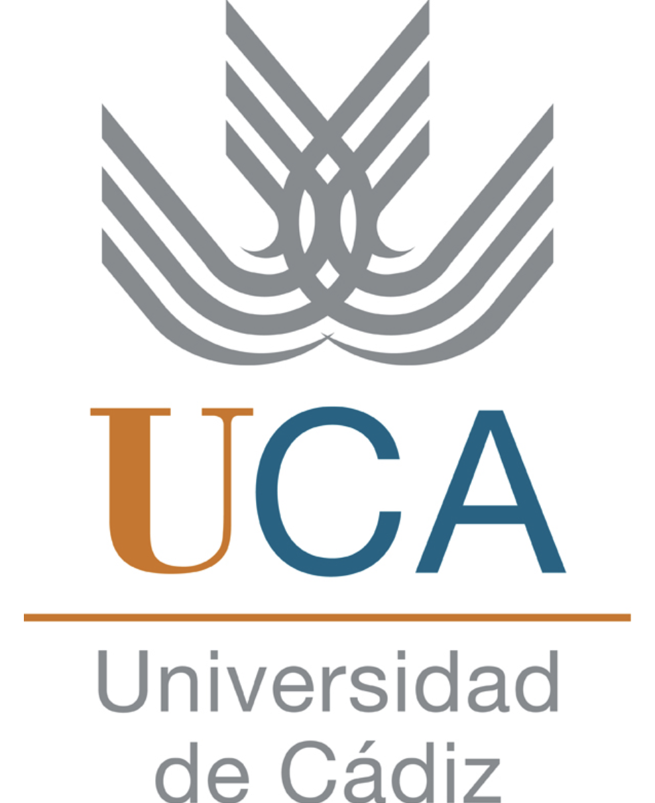

<!-- ==================== PORTADA ==================== -->

   

## Las pesquerías del Pacífico Noreste: Análisis del Área FAO 67

 

### Universidad de Cádiz
#### Facultad de Ciencias del Mar y Ambientales

 

**Asignatura:** Pesquerías.

**Profesora:** Remedios Cabrera Castro

 

**Autores:** Christian Dibari y Yule Petisco Lucero
**Curso:** 2026–2027

   

Puerto Real, Cádiz  
Octubre 2026

<!-- Salto de página para el PDF -->

<!-- ================= OTRAS PÁGINAS ================= -->

## Las áreas FAO

Las áreas FAO constituyen una división geográfica a escala global implementada por la Organización de las Naciones Unidas para la Alimentación y la Agricultura con el fin de estandarizar la recolección, el análisis y la difusión de las estadísticas pesqueras internacionales. Su relevancia científica radica en que facilitan la evaluación del estado de las poblaciones ícticas, la monitorización de los volúmenes de extracción y la formulación de estrategias de gobernanza y conservación adecuadas para cada ecosistema marino.

## Características oceanográficas principales de la zona

